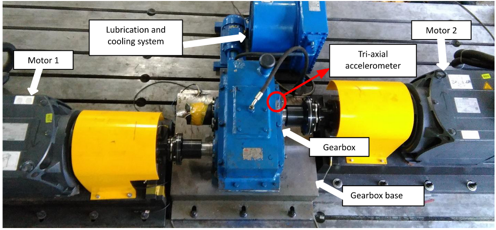

# PHM Challenge 2023

This Repository contains a solution for the PHM North America 2023 Conference Data Challenge. The challenge addresses the problem of estimating gearbox degradation in a gearbox operated under a variety of conditions, and emphasizes metrics of trust, robustness and explainability.
This Solution uses a probabilistic estimation of the gearbox degradation by vibration analysis and Random Convolutional Kernel Transform implemented with sktime and scored 157 Points at the validation Data set and came in on 8th place out of 106 contestants.

## Problem description

The task is to develop a fault severity estimate using the data provided. The training dataset includes measurements under varied operating conditions from a healthy state as well as six known fault levels. The testing and validation datasets contain data from eleven health levels. Data from some fault levels and operating conditions are excluded from the training datasets to mirror real-world conditions where data collection may only be available from a subset of full range of operation. The training data are collected from a range of different operating conditions under 15 different rotational speeds and 6 different torque levels. Test and validation data operating conditions span 18 different rotational speeds and 6 different torque levels. A model should generalize over previously unseen operational conditions and fault levels.

The gear pitting experiments were performed on a one-stage gearbox installed in an electronically closed transmission test rig.  The gearbox test rig includes two 45 kW Siemens servo motors.  One of the motors can act as the driving motor while the other can be configured as the load motor.  Motor 1 is the driving motor in this experiment. The overall gearbox test rig, excluding the control system, is shown in Fig. 1.

A tri-axial accelerometer was attached on the gearbox case close to the bearing house on the output end as shown in Figure 3. X, Y, Z are horizontal, axial and vertical, separately.

Both healthy and gradually pitted gear under various operating conditions were tested and the vibration signals collected. Each .txt data file is named with the corresponding rpm and torque values. V100_200N_2.txt means rotational speed of 100 rpm of the input shaft with a 200 Nm torque on the output shaft. ‘_2’ represents the second repetition of the data collection. For all operation conditions, 5 sets of data were collected.

The complete Problem description and evaluation metrics can be found on the official challenge website:
https://data.phmsociety.org/phm2023-conference-data-challenge/

## Dataset

## Schematic Solution Architecture

## Results

## Key Features
- ETL Pipeline with Apache Airflow that gets the data with a WebHook and saves it in a Cassandra DB
- Blue/Green Deployment with mirrowed Data on Managed Online Endpoint for Model testing
- Chron Function that forecasts every x seconds, evaluates the result and dispklayes data in a Web Application

## TechStack
- Apache Airflow
- Apache Spark
- Cassandra DB
- PyTorch
- Azure Managed Online Endpoint
- Streamlit