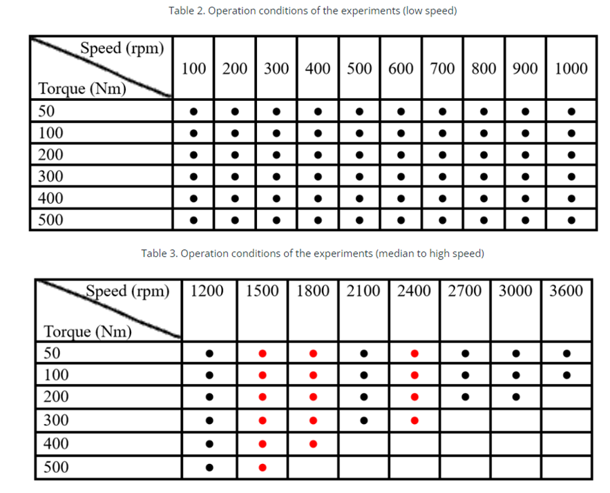

# PHM Challenge 2023 Solution
This repository contains a solution developed for the PHM North America 2023 Conference Data Challenge. The challenge focused on estimating gearbox degradation under a variety of operating conditions. The presented solution employs a probabilistic approach to gearbox degradation estimation through vibration analysis, combined with a Random Convolutional Kernel Transform (ROCKET) implemented using sktime. The solution achieved a score of 157 points on the validation dataset, securing 8th place out of 106 participants.

## Problem Overview
The objective of this challenge was to estimate fault severity using the provided dataset. The training dataset included vibration measurements collected from a healthy gearbox as well as from gears experiencing six different fault levels, all under various operating conditions. The testing and validation datasets contained data spanning eleven health levels. Crucially, some fault levels and operating conditions were excluded from the training set, reflecting real-world scenarios where full-range operational data may be unavailable.

Training data was collected under 15 different rotational speeds and 6 torque levels. In contrast, the test and validation datasets included 18 rotational speeds, alongside the same torque levels. The model needed to generalize well to previously unseen fault levels and operating conditions.

The gear pitting experiments were conducted on a one-stage gearbox, housed within an electronically controlled transmission test rig. The test setup featured two 45 kW Siemens servo motors, one serving as the driving motor (Motor 1) and the other as the load motor. The experimental setup is depicted below:

A tri-axial accelerometer was mounted near the gearbox output bearing. Its three axes—X, Y, and Z—corresponded to horizontal, axial, and vertical directions, respectively.

Both healthy gears and those with progressively worsening pitting were tested under various operating conditions, with vibration data collected for each configuration. Each .txt file in the dataset is named based on the corresponding rotational speed and torque. For example, V100_200N_2.txt represents data collected at 100 rpm with 200 Nm torque, with _2 indicating the second repetition of data collection. For every operating condition, five data sets were recorded.

For a detailed description of the problem and evaluation metrics, visit the official challenge website: [PHM 2023 Data Challenge](https://data.phmsociety.org/phm2023-conference-data-challenge/)

## Dataset Overview
The dataset consists of multiple CSV files, each containing vibration data recorded under a specific operating condition. Additionally, an indicator signals the completion of a full gear rotation. The key variables in the dataset include rotational speed, torque, and degradation level. 

While rotational speed and torque were provided for both training and test datasets, degradation levels for certain states were missing in the training data, specifically states 5, 7, 9, and 10. The red dots in the table below indicate conditions that were absent in the training data:

## Solution Overview
The solution employs a phased approach to tackle the problem, consisting of data preprocessing, feature extraction, and a combination of classification and regression models to predict gearbox degradation levels. A full description can be found in the [Methodology Description](PHM_Methodology_Description.pdf)

The time series data was segmented into smaller windows, with each segment corresponding to five complete gear rotations.
Key statistical features were extracted, including variance and root mean square (RMS) values.
A Fourier Transformation was applied to the segments, followed by logarithmic transformation to smoothen the frequency spectrum.
The transformed frequency spectrum was processed using Mini ROCKET (Random Convolution Kernel Transform) to extract meaningful features.
Prediction Pipeline:

The prediction process was divided into three stages to address the unique challenges posed by the dataset:

Part 1: Known Degradation States
A one-vs-all classification approach was implemented for the seven known degradation states.
The probabilistic nature of the model helped handle uncertainty, given the time-series splits.
Synthetic classes were introduced to minimize misclassification of unknown degradation states.

Part 2: Unknown Degradation States
A regression model was trained on unlabeled samples to estimate the severity of unknown fault levels.
Multiple predictions were made for each time-series segment.
Predictions corresponding to known states were set to zero, while the remaining predictions were normalized to ensure their sum was equal to one.

Part 3: Generalization to Unseen Operating Conditions
A custom Artificial Neural Network (ANN) was designed to handle previously unseen operating conditions.
The first layer of the ANN contained a custom structure where each feature was connected individually to the next layer, except for rotational speed and torque, which were connected to all neurons in the next layer.
The final output layer employed ridge regression to provide a more robust prediction.

## Results

This solution ranked 8th out of 106 participants, demonstrating strong generalization capability, particularly in the absence of training data for certain degradation states. For known degradation states, the model achieved 100% classification accuracy. The greatest challenge was predicting fault levels for which no training data was available. However, the phased approach combining classification and regression yielded reasonable accuracy for these unknown states as well.

In summary, the solution effectively handled the complex task of predicting gearbox degradation across both familiar and previously unseen operating conditions, contributing to its competitive performance in the PHM 2023 Challenge.

